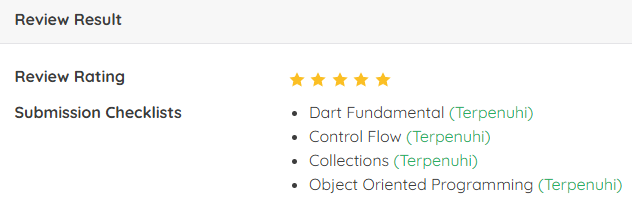

# Proyek Akhir: Memulai Pemrograman dengan Dart
## Penilaian Proyek
Proyek ini berhasil mendapatkan bintang 5/5 pada submission dicoding course Memulai Pemrograman dengan Dart.

Kriteria tambahan yang saya kerjakan sehingga mendapatkan nilai terbaik:
1. Kriteria Dart Fundamental: Advanced
2. Kriteria Control Flow: Advanced
3. Kriteria Collections: Advanced
4. Kriteria OOP: Advanced

# Submission Dart

Selamat datang di tahap akhir kelas Dart!

Untuk menyelesaikan kelas ini, Anda perlu mengerjakan **Submission** sebagai bentuk evaluasi pemahaman Anda. Submission ini terdiri dari **4 Exam** yang harus Anda selesaikan.

- [Exam 1](bin/exam1/README%20-%20Exam%201.md)
- [Exam 2](bin/exam2/README%20-%20Exam%202.md)
- [Exam 3](bin/exam3/README%20-%20Exam%203.md)
- [Exam 4](bin/exam4/README%20-%20Exam%204.md)

Setiap Exam memiliki **3 tugas (TODO)** yang bisa dikerjakan. Anda bebas memilih tugas mana yang ingin diselesaikan terlebih dahulu. Namun, **setiap Exam harus memiliki minimal 1 tugas yang terselesaikan** agar dianggap memenuhi kriteria kelulusan.

Gunakan pengetahuan yang telah Anda peroleh selama belajar di kelas ini dan tunjukkan kemampuan Anda dalam menguasai Dart.

Selamat mengerjakan dan semoga sukses!

## Menjalankan Exam
1. Silakan amati code editor Anda pada bagian Run / Edit Configuration. Silakan edit konfigurasi Exam 1.
2. Setelah itu, Anda akan mendapati dialog box bernama Run / Edit Configuration. Ubah nilai pada kolom Program arguments dengan nama Anda yang tertera pada akun profil Dicoding Anda. Tekan OK apabila sudah benar.
3. Kemudian, jalankan Exam 1 dengan cara menekan tombol Run.
4. Untuk exam 2, 3, dan 4, Anda cukup memilih konfigurasi yang ingin dijalankan.

## Menguji Exam
1. Langkahnya serupa dengan menjalankan Exam. Silakan amati code editor Anda pada bagian Run / Edit Configuration. Silakan edit konfigurasi Test Exam 1.
2. Setelah itu, Anda akan mendapati dialog box bernama Run / Edit Configuration. Ubah nilai pada kolom Environment variables dengan nama Anda yang tertera pada akun profil Dicoding Anda. Tekan OK apabila sudah benar.
3. Kemudian, jalankan Exam 1 dengan cara menekan tombol Run.
4. Untuk pengujian exam 2, 3, dan 4, Anda cukup memilih konfigurasi yang ingin dijalankan.